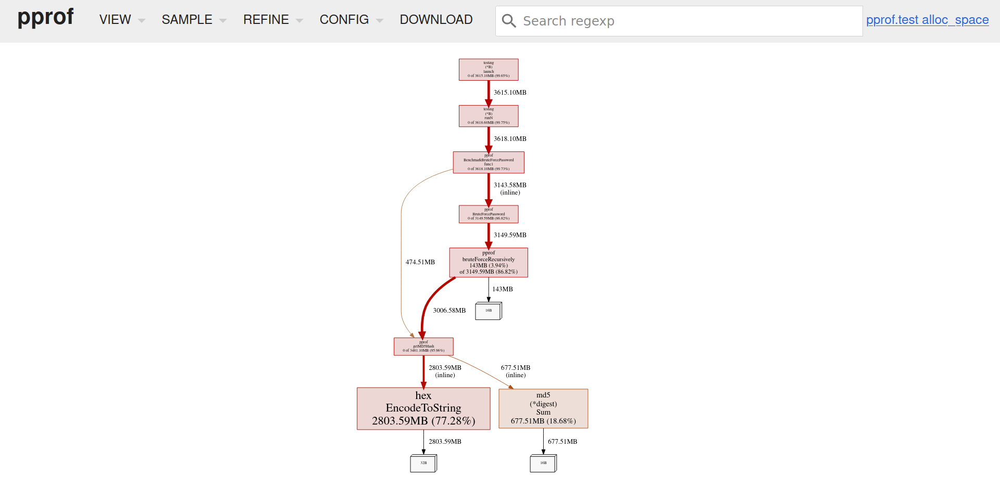
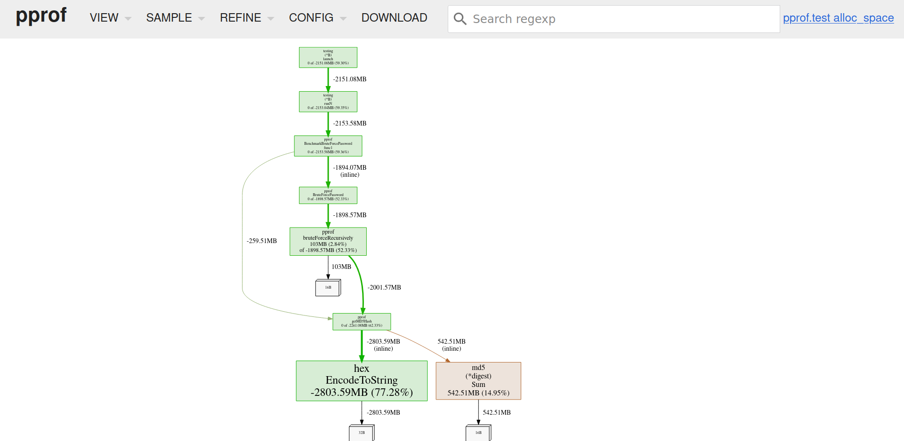

# Profiling and Optimization in Go
В этой репозитории я постараюсь просто объяснить, что такое профилирование и как его применять на практике, чтобы оптимизировать ваши программы.
## What is profiling and optimization?
Если ваша программа работает недостаточно быстро, сильно нагружает CPU или потребляет много памяти, процесс выявления проблем называется профилирование, а их исправление — оптимизация.

## Profiling in Go
В Go существует встроенный профайлер и утилита для визуализации результатов профилирования. Основные типы профилирования:

- Инструментальное профилирование (source or binary)
- Семплирующее профилирование

В Go используется семплирующий профайлер. Это значит, что с какой-то периодичностью профайлер прерывает работу программы, берет стек-трейс и записывает его.

###### Подробнее о классификации профилировщиков можно прочитать по этой [ссылке](https://www.delphitools.info/samplingprofiler/).

## How to get profiling
Существует три способа получения профилирования (по крайней мере, которые я знаю):
1. С помощью benchmark тестов. Мы можем запустить бенчмарк тест с флагами `-cpuprofile` и `-memprofile`.
```shell
go test -bench=. -cpuprofile cpu.out -memprofile mem.out
```
2. Импортируя библиотеку `_ "net/http/pprof"`. Эта библиотека содержит `init` функцию, которая инициализирует хэндлеры для профилирования.
```go
package somepackage

import _ "net/http/pprof"
```
```shell
package pprof

func init() {
	http.HandleFunc("/debug/pprof/", Index)
	http.HandleFunc("/debug/pprof/cmdline", Cmdline)
	http.HandleFunc("/debug/pprof/profile", Profile)
	http.HandleFunc("/debug/pprof/symbol", Symbol)
	http.HandleFunc("/debug/pprof/trace", Trace)
}
```
3. Можно использовать функции `runtime.StartCPUProfile` или `runtime.WriteHeapProfile` в коде.

## Practicing
Рассмотрим пример простой программы на Go. Задача программы — найти захэшированный пароль, зная его максимальную длину и возможные символы.
```go
package main

import (
	"crypto/md5"
	"encoding/hex"
)

// Максимальная длина пароля
const maxPasswordLength = 5

// Возможные символы
var chars = []string{"a", "b", "c", "d", "e", "f", "g"}

func BruteForcePassword(hash string) string {
	return bruteForceRecursively(hash, "")
}

func bruteForceRecursively(hash string, passwd string) string {
	if compareHash(hash, getMD5Hash(passwd)) {
		return passwd
	}
	for i := 0; i < len(chars); i++ {
		if len(passwd) == maxPasswordLength {
			return ""
		}
		if str := bruteForceRecursively(hash, passwd+chars[i]); str != "" {
			return str
		}
	}
	return ""
}

// Хэширующая функция
func getMD5Hash(text string) string {
	hasher := md5.New()
	hasher.Write([]byte(text))
	return hex.EncodeToString(hasher.Sum(nil))
}

func compareHash(a, b string) bool {
	return a == b
}
```
Функция `bruteForceRecursively` отвечает за генерацию паролей. Это рекурсивная функция, которая строит дерево всех возможных вариантов паролей и сравнивает хэш с паролем, который необходимо найти. Если хэш совпадает, функция возвращает этот пароль.

Напишем простой unit тест для проверки правильности работы программы.
###### Для написания тестов используется стандартная библиотека `testing`. Написание тестов — полезный навык, который помогает быстро проверить правильность работы программы и найти баги перед тем, как оно сломает прод (если QA профукал).
```go
package main

import (
	"fmt"
	"testing"
)

func TestBruteForcePassword(t *testing.T) {
	var table = []struct {
		input string
	}{
		{input: "a"},
		{input: "ba"},
		{input: "cf"},
	}

	for _, tab := range table {
		t.Run(fmt.Sprintf("input_%s", tab.input), func(t *testing.T) {
			if got := BruteForcePassword(getMD5Hash(tab.input)); got != tab.input {
				t.Errorf("Error want %s, got %s", tab.input, got)
			}
		})
	}
}
```
Команда для запуска теста:
```shell
go test -run=TestBruteForcePassword
```
Напишем benchmark тест для получения профиля программы и дальнейшего сравнивания результатов оптимизации.
###### Benchmark тесты помогают проверить производительность всей программы, или каждой отдельной функции.
```go
package main

import (
	"fmt"
	"testing"
)

func BenchmarkBruteForcePassword(b *testing.B) {
	var table = []struct {
		input string
	}{
		{input: "a"},
		{input: "ba"},
		{input: "cf"},
	}
	for _, tab := range table {
		b.Run(fmt.Sprintf("input_%s", tab.input), func(b *testing.B) {
			for i := 0; i < b.N; i++ {
				BruteForcePassword(getMD5Hash(tab.input))
			}
		})
	}
}
```
Запуск бенчмарк теста:
```shell
go test -bench=BenchmarkBruteForcePassword -benchmem -cpuprofile pprof/cpu_1.out -memprofile pprof/mem_1.out -count 5 > test/1.txt
```
Используя `-bench`, указываем, какой тест запустить, флаги `-cpuprofile` и `-memprofile` используются для получения профиля по CPU и памяти, сохраняя их в файлы `cpu_1.out` и `mem_1.out`, флаг `-count` нужен, чтобы задать количество повторении теста, для получения более точных оценки бенчмарка, и в конце результаты сохраняются в файл test_1.txt. Последующем мы можем сравнить результаты бенчмарка с помощью инструмента `benchcmp`.

Теперь у нас в корневом каталоге появились два новых файла `cpu_1.out` и `mem_1.out`. Мы можем воспользоваться инструментом `pprof` для визуализации этих данных.

Но перед тем как смотреть результаты профилирования, давайте попытаемся самостоятельно найти ресурса не эффективны части кода и оптимизировать их.

Я посчитал что функция `bruteForceRecursively` неэффективна по памяти, так как она рекурсивная и каждый рекурсивный вызов функции складывается в стэк вызовов.
```go
func bruteForceRecursively(hash string, passwd string) string {
	if compareHash(hash, getMD5Hash(passwd)) {
		return passwd
	}
	for i := 0; i < len(chars); i++ {
		if len(passwd) == maxPasswordLength {
			return ""
		}
		if str := bruteForceRecursively(hash, passwd+chars[i]); str != "" {
			return str
		}
	}
	return ""
}
```

### pprof tool
Инструмент `pprof` помогает визуализировать результаты профилирования в командной строке или в браузере.

Запуск профиля в командной строке
```shell
go tool pprof pprof/cpu_1.out
```
```shell
File: pprof.test
Type: cpu
Time: Jul 5, 2024 at 5:00pm (+05)
Duration: 24.71s, Total samples = 26.38s (106.76%)
Entering interactive mode (type "help" for commands, "o" for options)
(pprof) 
```

Если ввести команду `help`, можно увидеть множество команд для работы с профилем:
```shell
(pprof) help
  Commands:
    callgrind        Outputs a graph in callgrind format
    comments         Output all profile comments
    disasm           Output assembly listings annotated with samples
    dot              Outputs a graph in DOT format
    eog              Visualize graph through eog
    evince           Visualize graph through evince
    gif              Outputs a graph image in GIF format
    gv               Visualize graph through gv
    kcachegrind      Visualize report in KCachegrind
    list             Output annotated source for functions matching regexp
    pdf              Outputs a graph in PDF format
    peek             Output callers/callees of functions matching regexp
    png              Outputs a graph image in PNG format
    proto            Outputs the profile in compressed protobuf format
    ps               Outputs a graph in PS format
    raw              Outputs a text representation of the raw profile
    svg              Outputs a graph in SVG format
    tags             Outputs all tags in the profile
    text             Outputs top entries in text form
    top              Outputs top entries in text form
    topproto         Outputs top entries in compressed protobuf format
    traces           Outputs all profile samples in text form
    tree             Outputs a text rendering of call graph
    web              Visualize graph through web browser
    weblist          Display annotated source in a web browser
    o/options        List options and their current values
    q/quit/exit/^D   Exit pprof

  Options:
    call_tree        Create a context-sensitive call tree
    compact_labels   Show minimal headers
    divide_by        Ratio to divide all samples before visualization
    drop_negative    Ignore negative differences
    edgefraction     Hide edges below <f>*total
    focus            Restricts to samples going through a node matching regexp
    hide             Skips nodes matching regexp
    ignore           Skips paths going through any nodes matching regexp
    intel_syntax     Show assembly in Intel syntax
    mean             Average sample value over first value (count)
    nodecount        Max number of nodes to show
    nodefraction     Hide nodes below <f>*total
    noinlines        Ignore inlines.
    normalize        Scales profile based on the base profile.
    output           Output filename for file-based outputs
    prune_from       Drops any functions below the matched frame.
    relative_percentages Show percentages relative to focused subgraph
    sample_index     Sample value to report (0-based index or name)
    show             Only show nodes matching regexp
    show_from        Drops functions above the highest matched frame.
    source_path      Search path for source files
    tagfocus         Restricts to samples with tags in range or matched by regexp
    taghide          Skip tags matching this regexp
    tagignore        Discard samples with tags in range or matched by regexp
    tagleaf          Adds pseudo stack frames for labels key/value pairs at the callstack leaf.
    tagroot          Adds pseudo stack frames for labels key/value pairs at the callstack root.
    tagshow          Only consider tags matching this regexp
    trim             Honor nodefraction/edgefraction/node

count even at expense of dropping details
    unit             Measurement units for the data

```

С помощью команды `top` можно посмотреть топ 10 вызовов по использованию времени процессора или памяти, в зависимости от того, какой профиль мы смотрим.
```shell
(pprof) top                       
Showing nodes accounting for 19070ms, 75.86% of 25140ms total
Dropped 169 nodes (cum <= 125.70ms)
Showing top 10 nodes out of 62
      flat  flat%   sum%        cum   cum%
    7590ms 30.19% 30.19%     7590ms 30.19%  crypto/md5.block
    3700ms 14.72% 44.91%     6880ms 27.37%  runtime.mallocgc
    1730ms  6.88% 51.79%     1730ms  6.88%  encoding/hex.Encode
    1120ms  4.46% 56.25%     1120ms  4.46%  runtime.nextFreeFast (inline)
    1020ms  4.06% 60.30%     1020ms  4.06%  runtime.memmove
    1010ms  4.02% 64.32%     2170ms  8.63%  runtime.concatstrings
     890ms  3.54% 67.86%     8890ms 35.36%  crypto/md5.(*digest).Write
     800ms  3.18% 71.04%     9100ms 36.20%  crypto/md5.(*digest).checkSum
     660ms  2.63% 73.67%     1920ms  7.64%  runtime.growslice
     550ms  2.19% 75.86%      730ms  2.90%  runtime.deductAssistCredit
```
Каждое поле означает следующее: допустим, у нас есть функция `foo()`, которая внутри вызывает ещё четыре функции `f1(), f2(), f3(), f4()`, и ещё сама делает что-то.
```shell
func foo() {
  f1()
  f2()
  f3()
  // do something here
  f4()
}
```
`Flat` — это процессорное время или память, потраченное только на `do something here`, а `Cum` — это всё вместе взятое `f1+f2+f3+f4+do something`.

###### Подробно можно прочитать по этой [ссылке](https://stackoverflow.com/questions/32571396/pprof-and-golang-how-to-interpret-a-results).

Команда `list` покажет вам source code вызова

Давайте воспользуемся командой `list` и посмотрим изнутри функцию `bruteForceRecursively`.
```shell
(pprof) list bruteForceRecursively
Total: 25.14s
ROUTINE ======================== github.com/zhayt/pprof.bruteForceRecursively in /pprof/main.go
     390ms     36.66s (flat, cum) 145.82% of Total
      30ms       30ms     17:func bruteForceRecursively(hash string, passwd string) string {
         .     18.17s     18:   if compareHash(hash, getMD5Hash(passwd)) {
         .          .     19:           return passwd
         .          .     20:   }
     140ms      140ms     21:   for i := 0; i < len(chars); i++ {
      10ms       10ms     22:           if len(passwd) == maxPasswordLength {
      20ms       20ms     23:                   return ""
         .          .     24:           }
     160ms     18.26s     25:           if str := bruteForceRecursively(hash, passwd+chars[i]); str != "" {
         .          .     26:                   return str
         .          .     27:           }
         .          .     28:   }
      30ms       30ms     29:   return ""
         .          .     30:}
         .          .     31:
         .          .     32:func getMD5Hash(text string) string {
         .          .     33:   hasher := md5.New()
         .          .     34:   hasher.Write([]byte(text))
```
Как видно в разделе `Total:`, можно увидеть сколько секунд потрачено на выполнение данной функции, также сколько времени заняло каждое выполняемое строчка кода.

Также с помощью команды `disasm` можно посмотреть ассемблерную инструкцию.

```shell
(pprof) disasm bruteForce           
Total: 29.43s
ROUTINE ======================== github.com/zhayt/pprof.bruteForceLinearReusingSpace
        1s     44.78s (flat, cum) 152.16% of Total
      60ms       60ms     505e60: CMPQ SP, 0x10(R14)                      ;github.com/zhayt/pprof.bruteForceRecursively main.go:17
      20ms       20ms     505e64: JBE 0x505fbe
         .          .     505e6a: PUSHQ BP                                ;main.go:17
         .          .     505e6b: MOVQ SP, BP
         .          .     505e6e: SUBQ $0x70, SP
      30ms       30ms     505e72: MOVQ BX, 0x88(SP)                       ;github.com/zhayt/pprof.bruteForceRecursively main.go:22
      70ms       70ms     505e7a: MOVQ AX, 0x80(SP)
         .          .     505e82: MOVL $0x0, 0x3b(SP)                     ;main.go:18
         .          .     505e8a: MOVB $0x0, 0x3f(SP)
         .     19.97s     505e8f: MOVUPS X15, 0x48(SP)                    ;github.com/zhayt/pprof.bruteForceRecursively main.go:19
      30ms       30ms     505e95: MOVUPS X15, 0x50(SP)
         .          .     505e9b: MOVUPS X15, 0x60(SP)                    ;main.go:19
         .          .     505ea1: XORL CX, CX
         .          .     505ea3: JMP 0x505ea8                            ;main.go:22
         .      390ms     505ea5: MOVQ DX, CX                             ;github.com/zhayt/pprof.bruteForceRecursively main.go:22
      40ms       40ms     505ea8: CMPQ CX, $-0x1
      30ms       30ms     505eac: JE 0x505f91
         .          .     505eb2: CMPQ CX, $0x5                           ;main.go:23
         .          .     505eb6: JNE 0x505ec0
      20ms       20ms     505eb8: MOVL $0x4, DX                           ;github.com/zhayt/pprof.bruteForceRecursively main.go:24
         .          .     505ebd: JMP 0x505ea5                            ;main.go:25
         .          .     505ebf: NOPL
      10ms       10ms     505ec0: JAE 0x505fb0                            ;github.com/zhayt/pprof.bruteForceRecursively main.go:27
         .          .     505ec6: MOVQ 0x48(SP)(CX*8), DX                 ;main.go:27
                                                                          ;github.com/zhayt/pprof.bruteForceRecursively main.go:27
      10ms       10ms     505ecb: MOVQ github.com/zhayt/pprof.chars+8(SB), SI
      90ms       90ms     505ed2: LEAQ -0x1(SI), DI
         .          .     505ed6: CMPQ DX, DI                             ;main.go:27
         .          .     505ed9: JNE 0x505eea
      30ms       30ms     505edb: MOVQ $0x0, 0x48(SP)(CX*8)               ;github.com/zhayt/pprof.bruteForceRecursively main.go:28
         .          .     505ee4: LEAQ -0x1(CX), DX                       ;main.go:29
         .          .     505ee8: JMP 0x505ea5                            ;main.go:30
         .          .     505eea: CMPQ SI, DX                             ;main.go:32
     120ms      120ms     505eed: JBE 0x505fa5                            ;github.com/zhayt/pprof.bruteForceRecursively main.go:32
                                                                          ;main.go:27
         .          .     505ef3: MOVQ github.com/zhayt/pprof.chars(SB), SI
      60ms       60ms     505efa: SHLQ $0x4, DX                           ;github.com/zhayt/pprof.bruteForceRecursively main.go:32
         .          .     505efe: MOVQ 0x8(SI)(DX*1), DI                  ;main.go:32
         .          .     505f03: MOVQ 0(SI)(DX*1), DX
     110ms      110ms     505f07: TESTQ DI, DI                            ;github.com/zhayt/pprof.bruteForceRecursively main.go:32
      20ms       20ms     505f0a: JBE 0x505f9b
         .          .     505f10: MOVZX 0(DX), DX                         ;main.go:32
         .          .     505f13: MOVB DL, 0x3b(SP)(CX*1)
         .      2.81s     505f17: INCQ 0x48(SP)(CX*8)                     ;github.com/zhayt/pprof.bruteForceRecursively main.go:33
         .          .     505f1c: INCQ CX                                 ;main.go:34
      10ms       10ms     505f1f: MOVQ CX, 0x40(SP)                       ;github.com/zhayt/pprof.bruteForceRecursively main.go:34
         .          .     505f24: LEAQ 0x1b(SP), AX                       ;main.go:35
         .     20.40s     505f29: LEAQ 0x3b(SP), BX                       ;github.com/zhayt/pprof.bruteForceRecursively main.go:35
         .          .     505f2e: CALL runtime.slicebytetostring(SB)      ;main.go:35
                                                                          ;github.com/zhayt/pprof.bruteForceRecursively main.go:35
      20ms       20ms     505f33: CALL github.com/zhayt/pprof.getMD5Hash(SB)
         .          .     505f38: MOVQ 0x88(SP), CX                       ;main.go:50
      20ms       20ms     505f40: CMPQ BX, CX                             ;github.com/zhayt/pprof.bruteForceRecursively main.go:50
      40ms       40ms     505f43: JE 0x505f49
         .          .     505f45: XORL AX, AX                             ;main.go:50
         .          .     505f47: JMP 0x505f61
      10ms       10ms     505f49: MOVQ AX, BX                             ;github.com/zhayt/pprof.bruteForceRecursively main.go:50
         .          .     505f4c: MOVQ 0x80(SP), AX                       ;main.go:50
         .          .     505f54: CALL runtime.memequal(SB)
         .          .     505f59: MOVQ 0x88(SP), CX
         .          .     505f61: TESTL AL, AL
         .          .     505f63: JNE 0x505f7a                            ;main.go:35
         .          .     505f65: MOVQ 0x80(SP), AX                       ;main.go:50
         .          .     505f6d: MOVQ CX, BX
         .          .     505f70: MOVQ 0x40(SP), DX                       ;main.go:22
         .          .     505f75: JMP 0x505ea5
         .          .     505f7a: XORL AX, AX                             ;main.go:36
      10ms       10ms     505f7c: LEAQ 0x3b(SP), BX                       ;github.com/zhayt/pprof.getMD5Hash main.go:36
         .          .     505f81: MOVQ 0x40(SP), CX                       ;main.go:36
         .          .     505f86: CALL runtime.slicebytetostring(SB)
      30ms       30ms     505f8b: ADDQ $0x70, SP                          ;github.com/zhayt/pprof.getMD5Hash main.go:36
         .          .     505f8f: POPQ BP                                 ;main.go:36
         .          .     505f90: RET
      10ms       10ms     505f91: XORL AX, AX                             ;github.com/zhayt/pprof.getMD5Hash main.go:40
         .          .     505f93: XORL BX, BX                             ;main.go:40
         .          .     505f95: ADDQ $0x70, SP
         .          .     505f99: POPQ BP
         .          .     505f9a: RET
         .          .     505f9b: XORL AX, AX                             ;main.go:32
         .          .     505f9d: MOVQ AX, CX
         .          .     505fa0: CALL runtime.panicIndex(SB)
      30ms       30ms     505fa5: MOVQ DX, AX                             ;github.com/zhayt/pprof.getMD5Hash main.go:32
         .          .     505fa8: MOVQ SI, CX                             ;main.go:32
         .          .     505fab: CALL runtime.panicIndex(SB)
         .          .     505fb0: MOVQ CX, AX                             ;main.go:27
         .          .     505fb3: MOVL $0x5, CX
         .          .     505fb8: CALL runtime.panicIndex(SB)
         .          .     505fbd: NOPL
         .          .     505fbe: MOVQ AX, 0x8(SP)                        ;main.go:17
         .          .     505fc3: MOVQ BX, 0x10(SP)
         .          .     505fc8: CALL runtime.morestack_noctxt.abi0(SB)
      60ms      270ms     505fcd: MOVQ 0x8(SP), AX                        ;github.com/zhayt/pprof.getMD5Hash main.go:17
      10ms       10ms     505fd2: MOVQ 0x10(SP), BX
         .          .     505fd7: ?                                       ;main.go:17
         .          .     505fd8: TESTL BH, DH
         .          .     505fda: ?
(pprof) 
```

Давайте посмотрим профиль памяти в браузере, для этого нужно задать флаг `-http`, и указать порт.
```shell
go tool pprof -http=:8081 pprof/mem_1.out
```


# Optimization

В браузере откроется наш профиль, здесь показано дерево вызовов. 

На что сперва нужно обратить внимание, это на самые жирные стрелки и самые большие прямоугольники. Это части кода, где у нас происходит больше всего потребления ресурса. 

Как мы можем увидеть, самое большое потребление памяти у нас происходит при кодировании среза байтов в строку. Зачем нужна эта функция? На самом деле, она нужна, чтобы преобразовать наш хэш в строку для последующего простого сравнения. Если спросите, почему не использовать простое преобразование типов string([]byte), на самом деле MD5 использует символы из кодировки UTF-16, а строка может содержать символы из UTF-8. Если мы просто будем преобразовывать в строку, мы можем потерять некоторые символы, и последующее сравнение будет неправильным.

Давайте изменим нашу функцию для хэширования, уберем `hex.EncodeToString` и сделаем так, чтобы функция возвращала срез из байтов.

```go
func getMD5Hash(text string) []byte {
	hasher := md5.New()
	hasher.Write([]byte(text))
	return hasher.Sum(nil)
}
```

Также нужно изменить функцию для сравниения хэшей
```go
func compareHash(a, b []byte) bool {
	if len(a) != len(b) {
		return false
	}
	for i := range a {
		if a[i] != b[i] {
			return false
		}
	}
	return true
}
```

И адаптировать оcтальные части кода под измененные функции.
```go
package main

import (
	"crypto/md5"
	"fmt"
)

const maxPasswordLength = 5

var chars = []string{"a", "b", "c", "d", "e", "f", "g"}

func BruteForcePassword(hash []byte) string {
	return bruteForceRecursively(hash, "")
}

func bruteForceRecursively(hash []byte, passwd string) string {
	if compareHash(hash, getMD5Hash(passwd)) {
		return passwd
	}
	for i := 0; i < len(chars); i++ {
		if len(passwd) == maxPasswordLength {
			return ""
		}
		if str := bruteForceRecursively(hash, passwd+chars[i]); str != "" {
			return str
		}
	}
	return ""
}

func getMD5Hash(text string) []byte {
	hasher := md5.New()
	hasher.Write([]byte(text))
	return hasher.Sum(nil)
}

func compareHash(a, b []byte) bool {
	if len(a) != len(b) {
		return false
	}
	for i := range a {
		if a[i] != b[i] {
			return false
		}
	}
	return true
}
```

Давайте получим профиль программы.

```shell
go test -bench=. -benchmem -cpuprofile pprof/cpu_2.out -memprofile pprof/mem_2.out -count 5 > test/2.txt
```

С помощью утилиты `benchcmp` можно сравнить результаты бэншмарк тестов
```shell
benchcmp test/1.txt test/2.txt 
```
```shell
benchcmp is deprecated in favor of benchstat: https://pkg.go.dev/golang.org/x/perf/cmd/benchstat
benchmark                                   old ns/op     new ns/op     delta
BenchmarkBruteForcePassword/input_a-12      1317          777           -41.01%
BenchmarkBruteForcePassword/input_a-12      1266          902           -28.74%
BenchmarkBruteForcePassword/input_a-12      1344          911           -32.25%
BenchmarkBruteForcePassword/input_a-12      1288          891           -30.85%
BenchmarkBruteForcePassword/input_a-12      1136          843           -25.76%
BenchmarkBruteForcePassword/input_ba-12     1557345       1240868       -20.32%
BenchmarkBruteForcePassword/input_ba-12     1616806       1205153       -25.46%
BenchmarkBruteForcePassword/input_ba-12     1861223       1012448       -45.60%
BenchmarkBruteForcePassword/input_ba-12     1775420       918983        -48.24%
BenchmarkBruteForcePassword/input_ba-12     1383503       1286306       -7.03%
BenchmarkBruteForcePassword/input_cf-12     3805359       3235021       -14.99%
BenchmarkBruteForcePassword/input_cf-12     4089552       3001456       -26.61%
BenchmarkBruteForcePassword/input_cf-12     4230232       2799046       -33.83%
BenchmarkBruteForcePassword/input_cf-12     4680614       3038944       -35.07%
BenchmarkBruteForcePassword/input_cf-12     4605645       2990334       -35.07%

benchmark                                   old allocs     new allocs     delta
BenchmarkBruteForcePassword/input_a-12      9              3              -66.67%
BenchmarkBruteForcePassword/input_a-12      9              3              -66.67%
BenchmarkBruteForcePassword/input_a-12      9              3              -66.67%
BenchmarkBruteForcePassword/input_a-12      9              3              -66.67%
BenchmarkBruteForcePassword/input_a-12      9              3              -66.67%
BenchmarkBruteForcePassword/input_ba-12     11216          5606           -50.02%
BenchmarkBruteForcePassword/input_ba-12     11216          5606           -50.02%
BenchmarkBruteForcePassword/input_ba-12     11216          5606           -50.02%
BenchmarkBruteForcePassword/input_ba-12     11216          5606           -50.02%
BenchmarkBruteForcePassword/input_ba-12     11216          5606           -50.02%
BenchmarkBruteForcePassword/input_cf-12     30419          15207          -50.01%
BenchmarkBruteForcePassword/input_cf-12     30419          15207          -50.01%
BenchmarkBruteForcePassword/input_cf-12     30419          15207          -50.01%
BenchmarkBruteForcePassword/input_cf-12     30419          15207          -50.01%
BenchmarkBruteForcePassword/input_cf-12     30419          15207          -50.01%

benchmark                                   old bytes     new bytes     delta
BenchmarkBruteForcePassword/input_a-12      240           48            -80.00%
BenchmarkBruteForcePassword/input_a-12      240           48            -80.00%
BenchmarkBruteForcePassword/input_a-12      240           48            -80.00%
BenchmarkBruteForcePassword/input_a-12      240           48            -80.00%
BenchmarkBruteForcePassword/input_a-12      240           48            -80.00%
BenchmarkBruteForcePassword/input_ba-12     240894        61401         -74.51%
BenchmarkBruteForcePassword/input_ba-12     240901        61354         -74.53%
BenchmarkBruteForcePassword/input_ba-12     240887        61359         -74.53%
BenchmarkBruteForcePassword/input_ba-12     240878        61344         -74.53%
BenchmarkBruteForcePassword/input_ba-12     240884        61344         -74.53%
BenchmarkBruteForcePassword/input_cf-12     653225        166406        -74.53%
BenchmarkBruteForcePassword/input_cf-12     653193        166406        -74.52%
BenchmarkBruteForcePassword/input_cf-12     653173        166401        -74.52%
BenchmarkBruteForcePassword/input_cf-12     653205        166402        -74.53%
BenchmarkBruteForcePassword/input_cf-12     653173        166402        -74.52%
```

Сравнение бенчмар результатов показывает что наша программа улучилось в среднем
- по скорости на 30%, 
- по количеству аллокации объектов на 55%, 
- по памяти на 76%

А для сравнивания профили нужно использовать флаг `-diff_base`

```shell
go tool pprof -http=:8082 -diff_base pprof/mem_1.out pprof/mem_2.out 
```



Видно, что мы оптимизировали нашу программу на -2153Мб (Зеленое то что было, красное это то что добавилось)

Также можно оптимизировать функцию `bruteForceRecursively`, как я говорил раньше она рекурсивная и это не очень по памяти.

Я сделал две итерации для оптимизации данной функции.

1. Сделал его линейным, теперь каждый сгенеренные пароли добавляется в стэк (срез из стрингов). Если сказать просто то заменил DFS на BFS

```go
func bruteForceLinear(hash []byte) string {
	stack := []string{""}

	for len(stack) > 0 {
		length := len(stack)
		for _, passwd := range stack {
			if compareHash(hash, getMD5Hash(passwd)) {
				return passwd
			}

			if len(passwd) < maxPasswordLength {
				for i := 0; i < len(chars); i++ {
					stack = append(stack, passwd+chars[i])
				}
			}
		}
		stack = stack[length:]
	}
	return ""
}
```

2. В первой итерации функция не вызывается рекурсивно, но slice-у приходится постоянно расти. Это дополнительная аллокация и лишняя работа по копированию элементов из старого массива в новый. По этому я сделал чтобы мы единенный выделили место для генерации пароля и работали только с нею.

```go
package main

func bruteForceLinearReusingSpace(hash []byte) string {
	buff := make([]byte, maxPasswordLength)
	state := make([]int, maxPasswordLength)

	var pos int
	for pos != -1 {
		if pos == maxPasswordLength {
			pos--
			continue
		}
		if state[pos] == len(chars)-1 {
			state[pos] = 0
			pos--
			continue
		}
		buff[pos] = chars[state[pos]][0]
		state[pos]++
		pos++
		if compareHash(hash, getMD5Hash(string(buff[:pos]))) {
			return string(buff[:pos])
		}
	}

	return ""
}
```

Конечно, вот исправленный текст с исправлениями правописания и грамматики:

# Conclusion

Go имеет мощные встроенные инструменты для профилирования, которые помогают нам найти узкие места в нашей программе. Пишите оптимальный код, если нужно оптимизировать, тогда оптимизируйте с умом, исходя из профилирования.

# Useful links

- ["Profiling and Optimizing Go", Prashant Varanasi - Ex Uber, Google, Microsoft Engineer](https://www.youtube.com/watch?v=N3PWzBeLX2M&ab_channel=PrashantV)
- ["Оптимизация программ на Go", Марко Кевац - Badoo](https://www.youtube.com/watch?v=0i1nO9gwACY&ab_channel=BadooTech)
- [Go за гранью скорости: pprof на проде | avito.code](https://youtu.be/OEUIzg-IeyM?si=AohKmH0VTyJ7M-wm)

## PS

Сравнение результатов последних изменений оставлю вам.

Если нужно что-то добавить или изменить, Welcome with PR!